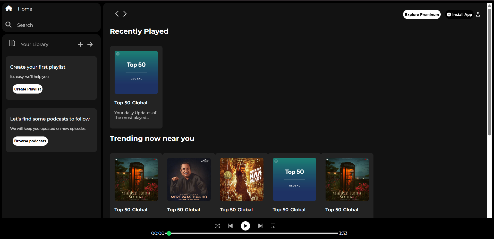

# Spotify

## About the Project

This project is a clone of the Spotify web player, designed to closely mimic the look and feel of the official Spotify app. It features a modern, responsive user interface built using HTML and CSS. The layout includes a sidebar for navigation, a main content area for playlists and charts, and a music player bar at the bottom, providing a realistic Spotify-like experience for learning and demonstration purposes.

## Live Demo

Check out the live demo here: [Spotify Web Player Clone](https://spotify-nine-indol.vercel.app/)

